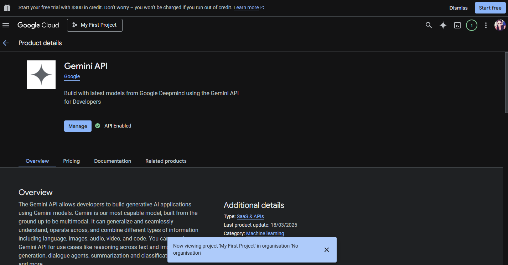

[Folder setup](#create-the-backend-folder-structure)

---

[Install Dependencies](#install-dependencies)

---

[configure-typescript](#configure-typescript)

---

[server.ts + app.ts — Entry Points](#serverts--appts--entry-points)

---

[env](#env--srcconfigindexts)

---
[modules](#modules)

---
[controllers folder](#controllers-folder)

---

[utility](#utility)

---

[middleware](#middleware)

---

## Table of content :

| 1            | 2                    | 3                          | 4      | 4       | 5          | 6                         | 7               | 8                               | 9                               | 10                        |
| ------------ | -------------------- | -------------------------- | ------ | ------- | ---------- | ------------------------- | --------------- | ------------------------------- | ------------------------------- | ------------------------- |
| Folder setup | Install Dependencies | configure-typescript + env | module | utility | middleware | Auth module + User module | Resource module | Review module + Bookmark module | Review module + Bookmark module | Auth module + User module |

# Create the backend folder structure

Set up all folders before writing any code

Run these commands in your terminal to create the project and all required folders:

### Step 1: Create backend folder

```bash
mkdir backend && cd backend
```

### Step 2: Initialize Node project

```bash
npm init -y
```

### Step 3: Create all required folders

```bash
mkdir -p src/models src/routes src/controllers src/middleware src/seed src/services
```

Preview:

```bash
backend/
src/
├── models/       # MongoDB schemas
├── routes/       # API route files
├── controllers/  # Business logic
├── middleware/   # Auth middleware
├── services/     # Gemini AI service
├── seed/         # Seed data
├── .env          # Environment variables
├── package.json
└── tsconfig.json

```

or

```bash
mkdir -p src/app/config
mkdir -p src/app/errors
mkdir -p src/app/middlewares
mkdir -p src/app/utils
mkdir -p src/app/routes
mkdir -p src/app/modules/Auth
mkdir -p src/app/modules/User
mkdir -p src/app/modules/Resource
mkdir -p src/app/modules/Review
mkdir -p src/app/modules/Bookmark
mkdir -p src/app/modules/AI
mkdir -p src/app/modules/Dashboard
mkdir -p src/seed
```

Preview:

```bash
backend/
├── src/
│   ├── server.ts                   ← starts server + connects DB
│   ├── app.ts                      ← express setup + middleware
│   └── app/
│       ├── config/
│       │   └── index.ts            ← all env variables in one place
│       ├── errors/
│       │   └── AppError.ts         ← custom error class
│       ├── middlewares/
│       │   ├── auth.ts             ← JWT protect, adminOnly, contributorOnly
│       │   ├── validateRequest.ts  ← Zod validation middleware
│       │   └── globalErrorHandler.ts← catches ALL errors
│       ├── utils/
│       │   ├── catchAsync.ts       ← removes try/catch from controllers
│       │   └── sendResponse.ts     ← standardises all responses
│       ├── routes/
│       │   └── index.ts            ← combines all module routes
│       └── modules/
│           ├── Auth/               ← register, login
│           ├── User/               ← user CRUD, role change
│           ├── Resource/           ← main item module
│           ├── Review/             ← reviews + ratings
│           ├── Bookmark/           ← saved resources (order module)
│           ├── AI/                 ← Gemini AI features
│           └── Dashboard/          ← admin analytics
├── src/seed/
│   └── seed.ts                     ← demo data
├── .env                            ← secrets
├── package.json
└── tsconfig.json

```

---

> [!NOTE]
>
> ### Folder structure explainer : Creating the Core Server Files
>
> Before building our data models, we need the "skeleton" of our server.
>
> #### 1. `src/app.ts` (The Application Setup)
>
> **Introduction:** This file is where you configure Express. You add "middlewares" (like CORS and JSON parsing) and set up your base routes. It defines _what_ the app does, but it doesn't start the server yet.
>
> #### 2. `src/server.ts` (The Server Entry Point)
>
> **Introduction:** This is the brain of your project. Its job is to:
>
> 1. Connect to your MongoDB database using Mongoose.
> 2. Start the Express app (`app.ts`) and listen for requests on a specific port.
>    **Why separate them?** It makes testing easier and keeps your code cleaner!

---

> [!NOTE]
>
> #### Step 5: Building the Folder Structure
>
> Now, we create the specialized folders that make up our MVC pattern.
>
> #### 1. src/config/
>
> Use Case: Centralizes all environment variables (API keys, DB URLs, Port numbers, JWT Secrets).
> Step: Create index.ts here to export your .env variables safely.
>
> #### 2. src/models/
>
> Use Case: Mongoose Schemas and Models.
> Step: Create your schemas here. This defines how your data (like Users or Events) is saved in MongoDB.
>
> #### 3. src/routes/
>
> Use Case: Defines the URL endpoints (e.g., /api/v1/users/login).

## Step: Create route files that map specific URLs to your Controller functions.

# Install Dependencies

We need several packages for building our server, handling types, and security.

### Step 1: Production dependencies

```bash
npm install express mongoose bcryptjs jsonwebtoken cors dotenv multer zod http-status @google/generative-ai
```

### Step 2: Dev dependencies (TypeScript + types)

These are only needed during development (for TypeScript support and auto-reloading).

```bash
npm install -D typescript ts-node nodemon @types/express @types/node @types/bcryptjs @types/jsonwebtoken @types/cors @types/multer
```

| Core packages                                        |                                           Extra packages |
| :--------------------------------------------------- | -------------------------------------------------------: |
| express — web framework                              |                                    multer — file uploads |
| mongoose — MongoDB ODM                               |                        @google/generative-ai — Gemini AI |
| bcryptjs — password hashing                          |                                 typescript — type safety |
| jsonwebtoken — JWT auth                              |                                 ts-node — run TypeScript |
| cors — cross-origin requests                         |                                   nodemon — auto restart |
| dotenv — environment variables                       |                             @types/\* — type definitions |
| zod — request body validation                        | tsconfig.json — create this file : Run: `npx tsc --init` |
| http-status — named HTTP codes (httpStatus.OK = 200) |                              Then set outDir to "./dist" |
| \_                                                   |                                   and rootDir to "./src" |

# Configure TypeScript

### Step 1 : tsconfig.json

Generate the tsconfig.json file to tell the compiler how to handle our code.

```bash
npx tsc --init
```

### Step 2: Add scripts to tsconfig.json:

tsconfig.json — paste this exactly: // "target":"ES2016", or "target": "ES2020",

```bash
{
  "compilerOptions": {
    "target":         "ES2020",
    "module":         "commonjs",
    "outDir":         "./dist",
    "rootDir":        "./src",
    "strict":         true,
    "esModuleInterop":true,
    "skipLibCheck":   true
  },
  "include": ["src/**/*"],
  "exclude": ["node_modules", "dist"]
}
```

### Step 3: How to Run Locally

To make development easy, we use ts-node-dev which restarts the server automatically when you save a file.

Add scripts to package.json:

```bash
"scripts": {
  "dev":   "nodemon --exec ts-node src/server.ts",
  "build": "tsc",
  "start": "node dist/server.js",
  "seed":  "ts-node src/seed/seed.ts"
}
```

To start development mode:

```bash
npm run dev
```

### Explainer: How to Compile TypeScript to JavaScript

Browsers and Node.js (in production) don't run TypeScript directly; they run JavaScript. To convert your code:

1. **Run the Build Command:**

   ```bash
   npm run build
   ```

   This uses the `tsc` (TypeScript Compiler) to read your `tsconfig.json` and generate a `dist/` folder containing pure `.js` files.

2. **Run the Compiled Code:**
   ```bash
   npm start
   ```
   This runs the production-ready code from the `dist/` folder.

---

# server.ts + app.ts — Entry Points

## add src/app.ts

```bash
import cors from 'cors';
import express, { Application, Request, Response } from 'express';
import router from './routes';

const app: Application = express();

// Parsers
app.use(express.json());
app.use(cors());

// Application routes
app.use('/api/v1', router);

// Testing route
app.get('/', (req: Request, res: Response) => {
  res.send('Event Management Server is running!');
});

// Not found route
app.use((req: Request, res: Response) => {
  res.status(404).json({
    success: false,
    message: 'Route not found',
  });
});

export default app;
```

## add src/server.ts

```bash
import mongoose from 'mongoose';
import app from './app';
import config from "./app/config";
async function main() {
  try {
    if (!config.database_url) {
      throw new Error('Database URL is not provided in environment variables');
    }

    await mongoose.connect(config.database_url);
    console.log('Connected to MongoDB successfully');

    app.listen(config.port, () => {
      console.log(`Server is listening on port ${config.port}`);
    });
  } catch (err) {
    console.error('Failed to connect to MongoDB', err);
    process.exit(1);
  }
}

main();
```

# .env + src/config/index.ts

```bash
PORT=5000
MONGO_URI=mongodb://localhost:27017/studynest
JWT_SECRET=studynest_super_secret_key_min_32_chars_long
JWT_EXPIRES_IN=30d
GEMINI_API_KEY=your_gemini_key_from_aistudio_google_com
FRONTEND_URL=http://localhost:3000
NODE_ENV=development
BCRYPT_SALT_ROUNDS=12
```

```bash

###---backend/.env---###

# ── Server ─────────────────────────────────────
PORT = 5000 ← keep as is
NODE_ENV = development ← keep as is

# ── Database ─────────────────────────────────────
MONGO_URI = mongodb://localhost:27017/studynest ← change this!
#-Authentication
JWT_SECRET = REPLACE_WITH_32+_CHAR_RANDOM_STRING ← change this!
JWT_EXPIRES_IN = 30d ← keep as is
BCRYPT_SALT_ROUNDS = 12 ← keep as is

# ── AI ─────────────────────────────────────
GEMINI_API_KEY = AIzaSyXXXXXXXXXXXXXXXXXXXXXXXXXXXXXXX ← get from Google

# ── CORS ─────────────────────────────────────
FRONTEND_URL = http://localhost:3000 ← keep as is
```

> [!IMPORTANT]
> collect all the env information from necessary site

- [MONGO_URI ](https://github.com/Sihambintahabib-ux/git-page-set-up-/blob/main/serversite.md#:~:text=mongodb%20cluster%20add%3A&text=mongodb%20cluster%20add%3A):

## src/config/index.ts

```bash
import dotenv from 'dotenv';
import path from 'path';

dotenv.config({ path: path.join(process.cwd(), '.env') });

export default {
  port: process.env.PORT || 5000,
  database_url: process.env.MONGODB_URI,
  bcrypt_salt_rounds: process.env.BCRYPT_SALT_ROUNDS || 12,
  jwt_secret: process.env.JWT_SECRET,
  jwt_expires_in: process.env.JWT_EXPIRES_IN,
  gemini_api_key: process.env.GEMINI_API_KEY,
};

```

---
> [!NOTE]
>
> MVC PATTERN : MODULE VIEW CONTROLLER PATTER 
# modules
## resource
### step 1: modules/types/resource.interface.ts - define all the type here
- model er khetre type cappital letter hoy `String` , ar typescript e type define korar somory type small letter hoy like `string`.
```bash
import { Schema } from "mongoose";

export interface IResource {
  title: string;
  description: string;
  fileUrl: string;
  thumbnail?: string;
  type: "pdf" | "video" | "notes" | "cheatsheet" | "test";
  subject: string;
  topic: string;
  difficulty: "beginner" | "intermediate" | "advanced";
 tags?: string[];
  uploadedBy: Schema.Types.ObjectId | string;
  downloads?: number;
  views?: number;
  averageRating?: number;
  reviewCount?: number;
  status?: "pending" | "approved" | "rejected";
}

```

### step 2:modules/Resource/resource.model.ts - use all the defined types and create schema
- model er khetre type cappital letter hoy `String` , ar typescript e type define korar somory type small letter hoy like `string`.

```bash
import { Schema, model } from 'mongoose';
import { IResource } from '../types/event.interface';

const resourceSchema = new Schema<IResource>({
  title:         { type: String, required: true, index: true },
  description:   { type: String, required: true },
  fileUrl:       { type: String, required: true },
  thumbnail:     { type: String, default: '' },
  type:          { type: String, enum: ['pdf','video','notes','cheatsheet','test'], required: true },
  subject:       { type: String, required: true, index: true },
  topic:         { type: String, required: true },
  difficulty:    { type: String, enum: ['beginner','intermediate','advanced'], required: true },
  tags:          [String],
  uploadedBy:    { type: Schema.Types.ObjectId, ref: 'User', required: true },
  downloads:     { type: Number, default: 0 },
  views:         { type: Number, default: 0 },
  averageRating: { type: Number, default: 0 },
  reviewCount:   { type: Number, default: 0 },
  status:        { type: String, enum: ['pending','approved','rejected'], default: 'pending' },
}, { timestamps: true });

export const Resource = model<IResource>('Resource', resourceSchema);

```

## user 
### step 1: modules/types/user.interface.ts - define all the type here

```BASH
export interface IUser {
  name: string;
  email: string;
  password?: string;
  role: "admin" | "user";
}

```
### step 2:modules/User/user.model.ts - use all the defined types and create schema

```BASH
import bcrypt from "bcrypt";


import { Schema, model } from "mongoose";
import { IUser } from "../../types/user.interface";
import config from "../../config";

const userSchema = new Schema<IUser>(
  {
    name: { type: String, required: true },
    email: { type: String, required: true, unique: true },
    password: { type: String, required: true, select: false },
    role: { type: String, enum: ["admin", "user"], default: "user" },
  },
  {
    timestamps: true,
  },
);

// Pre-save middleware / hook : will run before saving a document
userSchema.pre("save", async function (next) {
  // 'this' refers to the document about to be saved
  const user = this;

  // Only hash the password if it has been modified (or is new)
  if (!user.isModified("password")) {
    return next();
  }

  // Hash password using bcrypt salt rounds from config
  user.password = await bcrypt.hash(
    user.password as string,
    Number(config.bcrypt_salt_rounds),
  );

  next();
});

// Post-save middleware / hook : will run directly after saving a document
userSchema.post("save", function (user, next) {
  // doc is the document that was just saved
  // For example, we want to erase password field before returning doc after creation
  // Or simply log the information
  console.log(
    `[Post-Save Hook]: A new user was created with email: ${user.email}`,
  );

  // Note: Modifying doc here won't save it to DB (unless you call .save() again),
  // but it does affect the object returned from the save() method in controller.
  user.password = "";

  next();
});

export const User = model<IUser>("User", userSchema);

```

##

---

# controllers folder

## resource controller

```bash
import { Request, Response } from "express";
import { Resource } from "../modules/Resource/resource.model";

// Create Resource
const createResource = async (req: Request, res: Response) => {
  try {
    const savedResource = await Resource.create(req.body);
    res.status(201).json({
      success: true,
      message: "Resource created successfully",
      data: savedResource,
    });
  } catch (err: any) {
    res.status(500).json({
      success: false,
      message: "Failed to create Resource",
      error: err.message,
    });
  }
};

// Get all Resource
const getResources = async (req: Request, res: Response) => {
  try {
    const resources = await Resource.find();
    res.status(200).json({
      success: true,
      message: "Resources fetched successfully",
      data: resources,
    });
  } catch (err: any) {
    res.status(500).json({
      success: false,
      message: "Failed to fetch resources",
      error: err.message,
    });
  }
};

// Get single resource
const getResourceById = async (req: Request, res: Response) => {
  try {
    const resource = await Resource.findById(req.params.id);
    if (!resource) {
      return res.status(404).json({
        success: false,
        message: "resource not found",
      });
    }
    res.status(200).json({
      success: true,
      message: "resource fetched successfully",
      data: resource,
    });
  } catch (err: any) {
    res.status(500).json({
      success: false,
      message: "Failed to fetch resource",
      error: err.message,
    });
  }
};

// Update resource
const updateresource = async (req: Request, res: Response) => {
  try {
    const updatedResource = await Resource.findByIdAndUpdate(
      req.params.id,
      req.body,
      { new: true, runValidators: true },
    );
    if (!updatedResource) {
      return res.status(404).json({
        success: false,
        message: "Resource not found",
      });
    }
    res.status(200).json({
      success: true,
      message: "Resource updated successfully",
      data: updatedResource,
    });
  } catch (err: any) {
    res.status(500).json({
      success: false,
      message: "Failed to update Resource",
      error: err.message,
    });
  }
};

// Delete Resource
const deleteResource = async (req: Request, res: Response) => {
  try {
    const deletedResource = await Resource.findByIdAndDelete(req.params.id);
    if (!deletedResource) {
      return res.status(404).json({
        success: false,
        message: "Resource not found",
      });
    }
    res.status(200).json({
      success: true,
      message: "Resource deleted successfully",
      data: null,
    });
  } catch (err: any) {
    res.status(500).json({
      success: false,
      message: "Failed to delete Resource",
      error: err.message,
    });
  }
};

export const resourceControllers = {
  createResource,
  getResources,
  getResourceById,
  updateresource,
  deleteResource,
};

```

## user controller

```bash
import bcrypt from 'bcrypt';
import { Request, Response } from 'express';
import jwt, { Secret } from 'jsonwebtoken';
import config from '../config';
import { User } from '../models/user.model';

// Register user
const register = async (req: Request, res: Response) => {
  try {
    const { email } = req.body;
    
    // Check if user already exists
    const isUserExist = await User.findOne({ email });

    if (isUserExist) {
      return res.status(400).json({
        success: false,
        message: 'User already exists!',
      });
    }

    const savedUser = await User.create(req.body);
    
    // Generate token
    const token = jwt.sign(
      { email: savedUser.email, role: savedUser.role },
      config.jwt_secret as Secret,
      { expiresIn: config.jwt_expires_in as any }
    );

    // Omit password from response
    const userResponse = savedUser.toObject();
    delete userResponse.password;

    res.status(201).json({
      success: true,
      message: 'User registered successfully',
      data: userResponse,
      token,
    });
  } catch (err: any) {
    res.status(500).json({
      success: false,
      message: 'Failed to register user',
      error: err.message,
    });
  }
};

// Login user
const login = async (req: Request, res: Response) => {
  try {
    const { email, password } = req.body;
    
    // Check if user exists
    const user = await User.findOne({ email }).select('+password');
    if (!user) {
      return res.status(401).json({
        success: false,
        message: 'Invalid email or password',
      });
    }

    // Compare passwords
    const isPasswordMatch = await bcrypt.compare(password, user.password as string);
    if (!isPasswordMatch) {
      return res.status(401).json({
        success: false,
        message: 'Invalid email or password',
      });
    }

    // Generate token
    const token = jwt.sign(
      { email: user.email, role: user.role },
      config.jwt_secret as Secret,
      { expiresIn: config.jwt_expires_in as any }
    );

    // Omit password from response
    const userResponse = user.toObject();
    delete userResponse.password;

    res.status(200).json({
      success: true,
      message: 'User logged in successfully',
      token,
      data: userResponse, 
    });

  } catch (err: any) {
    res.status(500).json({
      success: false,
      message: 'Failed to login',
      error: err.message,
    });
  }
};

// Get all users
const getUsers = async (req: Request, res: Response) => {
  try {
    const users = await User.find().select('-password');
    res.status(200).json({
      success: true,
      message: 'Users fetched successfully',
      data: users,
    });
  } catch (err: any) {
    res.status(500).json({
      success: false,
      message: 'Failed to fetch users',
      error: err.message,
    });
  }
};

export const userControllers = {
  register,
  login,
  getUsers,
};
```

---
## ai controller


```bash
import { GoogleGenerativeAI } from "@google/generative-ai";
import { Request, Response } from "express";
import config from "../config";

const generateDescription = async (req: Request, res: Response) => {
  try {
    const { title } = req.body;

    if (!title) {
      return res.status(400).json({
        success: false,
        message: "Event title is required to generate a description",
      });
    }

    if (!config.gemini_api_key) {
      return res.status(500).json({
        success: false,
        message: "Gemini API key is not configured",
      });
    }

    // Initialize Gemini
    const genAI = new GoogleGenerativeAI(config.gemini_api_key as string);
    const model = genAI.getGenerativeModel({ model: "gemini-1.5-flash" });

    const prompt = `Write a catchy and informative event description for an event titled: "${title}". Keep it around 100 words.`;

    const result = await model.generateContent(prompt);
    const response = await result.response;
    const text = response.text();

    res.status(200).json({
      success: true,
      message: "Description generated successfully",
      data: text,
    });
  } catch (err: any) {
    res.status(500).json({
      success: false,
      message: "Failed to generate description",
      error: err.message,
    });
  }
};

export const aiControllers = {
  generateDescription,
};


```


# router

## index router
```bash
import express from "express";
import { AiRoutes } from "./ai.route";
import {  ResourceRoutes } from "./event.route";
import { UserRoutes } from "./user.route";

const router = express.Router();

const moduleRoutes = [
  {
    path: "/resources",
    route: ResourceRoutes,
  },
  {
    path: "/users",
    route: UserRoutes,
  },
  {
    path: "/ai",
    route: AiRoutes,
  },
];

moduleRoutes.forEach((route) => router.use(route.path, route.route));

export default router;

```
## resource router
```bash
import express from "express";
import { resourceControllers } from "../controllers/event.controller";

const router = express.Router();
// Get all events
router.get("/", resourceControllers.getResources);
// Get single event
router.get("/:id", resourceControllers.getResourceById);
// Create event
router.post("/", resourceControllers.createResource);
// Update event
router.put("/:id", resourceControllers.updateResource);
// Delete event
router.delete("/:id", resourceControllers.deleteResource);

export const ResourceRoutes = router;

```
## ai router
```bash
import express from "express";
import { aiControllers } from "../controllers/ai.controller";

const router = express.Router();

router.post("/generate-description", aiControllers.generateDescription);

export const AiRoutes = router;

```
## user router
```bash
import express from "express";
import { userControllers } from "../controllers/user.controller";

const router = express.Router();

// Register user
router.post("/register", userControllers.register);
// Login user
router.post("/login", userControllers.login);
// Get all users
router.get("/", userControllers.getUsers);

export const UserRoutes = router;

```


# [ai integration ](https://github.com/touhidcodes/Level-1-Express-Mongoose-Server/blob/main/docs/GEMINI_INTEGRATION.md)
1. generate key 
2. if api is not connected (error show)
  - go to this website : [google claude](https://console.cloud.google.com/welcome?project=cosmic-decker-480606-r8)
  - google claude/lib - [liabery](https://console.cloud.google.com/apis/library?referrer=search&project=cosmic-decker-480606-r8)
  - search for generative ai - [generative ai](https://console.cloud.google.com/apis/library/generativelanguage.googleapis.com?project=cosmic-decker-480606-r8)
  
3. add GEMINI_API_KEY to env file 
4. export GEMINI_API_KEY from conflict/index.ts file
5. ai [controller](#ai-controller) create 

# utility

# middleware
